# Card Gallery Feature - Implementation Plan

## Overview
Add a new gallery page to the MunchkinGen application that displays all created cards organized by type (Monstre, Malédiction, Objet, Classe, Race, Autre) in a grid layout with search functionality.

## Requirements Summary
- **Navigation**: Tabbed interface within the current single-page app
- **Card Interaction**: Clicking a card opens it in the editor
- **Features**: Search functionality, "Create New Card" button
- **Layout**: Grid display organized by card type sections

## Architecture

```mermaid
graph TB
    subgraph App Component
        A[App.tsx] --> B[Header with Tab Navigation]
        B --> C{Active Tab}
        C -->|Editor| D[Current Editor Layout]
        C -->|Gallery| E[CardGallery Component]
    end
    
    subgraph Gallery View
        E --> F[Search Bar]
        E --> G[Create New Card Button]
        E --> H[Card Type Sections]
        H --> I[Monstre Section]
        H --> J[Malédiction Section]
        H --> K[Objet Section]
        H --> L[Classe Section]
        H --> M[Race Section]
        H --> N[Autre Section]
    end
    
    subgraph Card Display
        I --> O[CardThumbnail]
        J --> O
        K --> O
        L --> O
        M --> O
        N --> O
        O -->|onClick| P[Switch to Editor + Load Card]
    end
```



## File Structure

```
components/
├── CardForm.tsx        (existing)
├── CardPreview.tsx     (existing)
├── DeckStats.tsx       (existing)
├── CardGallery.tsx     (NEW - main gallery component)
└── CardThumbnail.tsx   (NEW - individual card in grid)
```

## Component Details

### 1. App.tsx Modifications

**Changes needed:**
- Add `activeView` state: `editor` | `gallery`
- Add tab navigation in header
- Conditional rendering based on active view
- Pass card selection handler to gallery

**New state:**
```typescript
const [activeView, setActiveView] = useState<'editor' | 'gallery'>('editor');
```

**Header modification:**
- Add two clickable tabs: "Éditeur" and "Galerie"
- Visual indicator for active tab
- Keep settings button in the same location

### 2. CardGallery.tsx (New Component)

**Props:**
```typescript
interface CardGalleryProps {
  cards: CardData[];
  onSelectCard: (card: CardData) => void;
  onNewCard: () => void;
  isLoading: boolean;
}
```

**Features:**
- Search input filtering cards by title
- Cards grouped by `CardType` in collapsible sections
- Grid layout within each section (responsive: 2-4 columns)
- Section headers showing type name and card count
- Empty state when no cards match search
- "Create New Card" floating button

**Layout structure:**
```
┌─────────────────────────────────────────────────┐
│  🔍 Search cards...          [+ Nouvelle Carte] │
├─────────────────────────────────────────────────┤
│                                                 │
│  ▼ Monstres (5)                                │
│  ┌─────┐ ┌─────┐ ┌─────┐ ┌─────┐ ┌─────┐      │
│  │ 📄  │ │ 📄  │ │ 📄  │ │ 📄  │ │ 📄  │      │
│  │Title│ │Title│ │Title│ │Title│ │Title│      │
│  └─────┘ └─────┘ └─────┘ └─────┘ └─────┘      │
│                                                 │
│  ▼ Objets (3)                                  │
│  ┌─────┐ ┌─────┐ ┌─────┐                       │
│  │ 📄  │ │ 📄  │ │ 📄  │                       │
│  │Title│ │Title│ │Title│                       │
│  └─────┘ └─────┘ └─────┘                       │
│                                                 │
│  ▼ Malédictions (2)                            │
│  ...                                            │
└─────────────────────────────────────────────────┘
```

### 3. CardThumbnail.tsx (New Component)

**Props:**
```typescript
interface CardThumbnailProps {
  card: CardData;
  onClick: () => void;
}
```

**Visual design:**
- Fixed size card preview (approximately 150x200px)
- Shows card image if available, placeholder if not
- Card title below/on the image
- Card type badge
- Hover effect: slight scale up + shadow
- Click feedback

**Thumbnail layout:**
```
┌───────────────────┐
│                   │
│   [Card Image]    │
│                   │
├───────────────────┤
│ Card Title        │
│ 🏷️ Type          │
└───────────────────┘
```

## Data Flow


## Styling Approach

Using existing Tailwind CSS classes to maintain consistency:

- **Background**: `bg-stone-100` (matches app)
- **Cards**: `bg-white rounded-lg shadow border border-gray-200`
- **Accent color**: `amber-*` palette (matches existing theme)
- **Grid**: `grid grid-cols-2 md:grid-cols-3 lg:grid-cols-4 gap-4`
- **Sections**: Collapsible with smooth transition

## Implementation Steps

1. **Create CardThumbnail component** - Simple, reusable card display
2. **Create CardGallery component** - Main gallery with all features
3. **Modify App.tsx** - Add tab navigation and view switching
4. **Test integration** - Ensure card selection works properly
5. **Polish styling** - Responsive design, hover effects, empty states

## Edge Cases to Handle

- Empty gallery (no cards saved yet)
- Search with no results
- Cards with missing images
- Long card titles (truncation)
- Many cards of one type vs few/none of another
- Loading state while fetching cards
- Error state if connection fails

## Accessibility Considerations

- Tab navigation should be keyboard accessible
- Cards should have proper focus states
- Search input should have proper label
- Section headers should use semantic headings
- Click targets should be appropriately sized

## Future Enhancements (Out of Scope)

- Card deletion from gallery
- Batch selection/export
- View toggle (grid vs list)
- Sorting options (alphabetical, date, level)
- Filter by multiple criteria
- Card duplication
