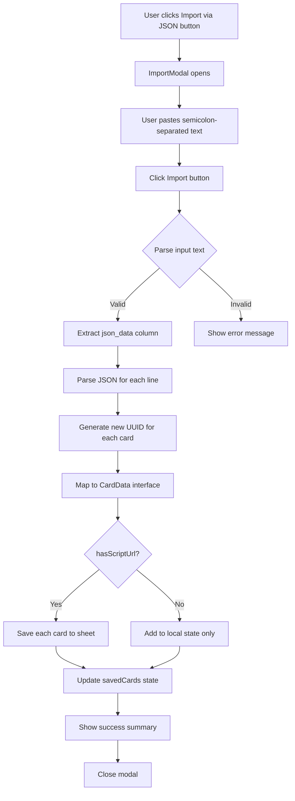

# Feature: JSON Import via Text Input

## Overview

Add a feature that allows users to import cards from a semicolon-separated text format where one column contains JSON card data.

## User Requirements

- **Button Location**: Editor view (in `CardForm` component header)
- **Auto-save**: Yes, imported cards are automatically saved to the Google Sheet
- **Duplicate Handling**: Generate new UUIDs for each imported card

## Input Format

The expected format is semicolon-separated with the following columns:
```
id;title;type;json_data;image_url;date
```

Example line:
```
101;Le Pote Anti-Weeb;Monstre;{"id":"uuid-101","title":"Le Pote Anti-Weeb","type":"Monstre","layout":"standard","level":14,...};;2026-01-23
```

**Key Points:**
- The `json_data` column (index 3) contains the full card JSON
- The JSON contains all card properties that match `CardData` interface
- The `image_url` column may be empty
- Users may paste multiple lines (one card per line)
- First line may be headers (should be detected and skipped)

## Architecture



## Component Structure

### New Component: ImportModal

Location: [`components/ImportModal.tsx`](components/ImportModal.tsx)

```typescript
interface ImportModalProps {
  isOpen: boolean;
  onClose: () => void;
  onImport: (cards: CardData[]) => Promise<void>;
}
```

**Responsibilities:**
- Display modal with textarea for pasting data
- Parse semicolon-separated input
- Extract and parse JSON from `json_data` column
- Validate parsed cards
- Show progress during import
- Display success/error feedback

### Modified Files

#### 1. [`App.tsx`](App.tsx)

Changes:
- Add state for import modal visibility: `showImportModal`
- Add `handleImportCards` function to:
  - Receive parsed cards from ImportModal
  - Generate new UUIDs
  - Save cards to sheet if `scriptUrl` exists
  - Update `savedCards` state
- Pass props to CardForm: `onImport`, `hasScriptUrl`

#### 2. [`components/CardForm.tsx`](components/CardForm.tsx)

Changes:
- Add "Import via JSON" button next to "Nouvelle Carte"
- Add `onImport` prop to trigger import modal
- Style button consistently with existing buttons

## Parsing Logic

### Step 1: Split Lines
```typescript
const lines = input.trim().split('\n').filter(line => line.trim());
```

### Step 2: Detect and Skip Header
```typescript
const isHeader = (line: string) => {
  const firstField = line.split(';')[0].toLowerCase();
  return firstField === 'id' || firstField === 'title';
};
```

### Step 3: Parse Each Line
```typescript
const parseLine = (line: string): CardData | null => {
  // Split by semicolon, but handle JSON containing semicolons
  const parts = parseCSVLine(line, ';');
  
  if (parts.length < 4) return null;
  
  const jsonData = parts[3]; // json_data column
  const imageUrl = parts[4] || ''; // image_url column
  
  try {
    const cardJson = JSON.parse(jsonData);
    // Generate new UUID
    cardJson.id = crypto.randomUUID?.() || Date.now().toString() + Math.random();
    // Use image_url from column 5 if present
    if (imageUrl) cardJson.storedImageUrl = imageUrl;
    return cardJson as CardData;
  } catch (e) {
    console.error('Failed to parse JSON:', e);
    return null;
  }
};
```

### Step 4: Handle JSON with Semicolons
The JSON in `json_data` column might contain semicolons. We need a smart parser:

```typescript
const parseCSVLine = (line: string, delimiter: string): string[] => {
  const result: string[] = [];
  let current = '';
  let inBraces = 0;
  let inQuotes = false;
  
  for (const char of line) {
    if (char === '"' && inBraces === 0) {
      inQuotes = !inQuotes;
    } else if (char === '{' && !inQuotes) {
      inBraces++;
      current += char;
    } else if (char === '}' && !inQuotes) {
      inBraces--;
      current += char;
    } else if (char === delimiter && inBraces === 0 && !inQuotes) {
      result.push(current);
      current = '';
    } else {
      current += char;
    }
  }
  result.push(current);
  
  return result;
};
```

## UI Design

### Import Modal Layout

```
┌─────────────────────────────────────────────────────────────┐
│  📥 Importer des cartes via JSON                        ✕   │
├─────────────────────────────────────────────────────────────┤
│                                                             │
│  Collez vos données au format:                             │
│  id;title;type;json_data;image_url;date                    │
│                                                             │
│  ┌───────────────────────────────────────────────────────┐ │
│  │                                                       │ │
│  │  (textarea for pasting data)                          │ │
│  │                                                       │ │
│  │                                                       │ │
│  │                                                       │ │
│  └───────────────────────────────────────────────────────┘ │
│                                                             │
│  ℹ️ Chaque ligne correspond à une carte.                   │
│     Un nouvel ID unique sera généré pour chaque carte.     │
│                                                             │
├─────────────────────────────────────────────────────────────┤
│                              [Annuler]  [📥 Importer]       │
└─────────────────────────────────────────────────────────────┘
```

### Import Progress State
```
┌─────────────────────────────────────────────────────────────┐
│  📥 Importation en cours...                                 │
├─────────────────────────────────────────────────────────────┤
│                                                             │
│  ████████████████░░░░░░░░░░░░░░░░░░░░░░░░  3/10 cartes     │
│                                                             │
│  ✓ Le Pote Anti-Weeb                                       │
│  ✓ Dragon Légendaire                                       │
│  ⏳ Épée de Foo...                                         │
│                                                             │
└─────────────────────────────────────────────────────────────┘
```

### Success Summary
```
┌─────────────────────────────────────────────────────────────┐
│  ✅ Importation terminée                                ✕   │
├─────────────────────────────────────────────────────────────┤
│                                                             │
│  10 cartes importées avec succès !                         │
│                                                             │
│  • 5 Monstres                                              │
│  • 3 Objets                                                │
│  • 2 Malédictions                                          │
│                                                             │
│  ⚠️ 2 lignes ignorées (format invalide)                   │
│                                                             │
├─────────────────────────────────────────────────────────────┤
│                                              [Fermer]       │
└─────────────────────────────────────────────────────────────┘
```

## Error Handling

| Error Type | Message | Recovery |
|------------|---------|----------|
| Empty input | "Veuillez coller des données à importer" | Keep modal open |
| No valid cards | "Aucune carte valide trouvée. Vérifiez le format." | Keep modal open, show format hint |
| Partial failure | "X cartes importées, Y erreurs" | Show which lines failed |
| Network error | "Erreur de sauvegarde: [message]" | Retry button |

## Data Validation

Before saving, each card is validated:

1. **Required fields**: `title`, `type`
2. **Type validation**: Must match `CardType` enum values
3. **Number fields**: `level`, `bonus`, `levelsGained` should be numbers or empty
4. **Boolean fields**: `isBig` should be boolean

```typescript
const validateCard = (card: Partial<CardData>): card is CardData => {
  if (!card.title || typeof card.title !== 'string') return false;
  if (!card.type || !Object.values(CardType).includes(card.type as CardType)) return false;
  return true;
};
```

## Implementation Steps

1. **Create `ImportModal.tsx`** component with:
   - Modal overlay and content
   - Textarea for pasting data
   - Parsing logic
   - Progress display
   - Error/success states

2. **Update `App.tsx`**:
   - Add `showImportModal` state
   - Add `handleImportCards` async function
   - Render ImportModal conditionally
   - Pass callback to CardForm

3. **Update `CardForm.tsx`**:
   - Add "Import via JSON" button
   - Add `onImport` prop type
   - Wire up button click

4. **Testing scenarios**:
   - Single card import
   - Multiple cards import
   - Invalid JSON handling
   - Network error handling
   - Large batch import (10+ cards)

## File Changes Summary

| File | Action | Changes |
|------|--------|---------|
| `components/ImportModal.tsx` | CREATE | New component for import UI and logic |
| `App.tsx` | MODIFY | Add state, handler, render ImportModal |
| `components/CardForm.tsx` | MODIFY | Add import button and prop |

## Acceptance Criteria

- [ ] "Import via JSON" button visible in Editor view when script URL is configured
- [ ] Modal opens on button click
- [ ] User can paste semicolon-separated data with JSON column
- [ ] Parser correctly extracts JSON from the `json_data` column
- [ ] New UUIDs are generated for each imported card
- [ ] Cards are saved to Google Sheet automatically
- [ ] Progress is displayed during import
- [ ] Success summary shows count by card type
- [ ] Errors are displayed with helpful messages
- [ ] Modal can be closed/cancelled at any time
